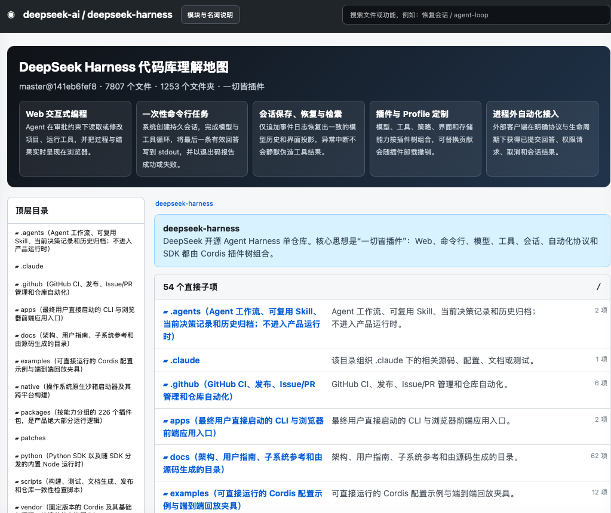

# 代码库理解地图 Skill

> **你还在为看不懂 GitHub 上的开源项目而烦恼吗？**
>
> README 看完感觉自己会了，点进 `src/` 大脑立刻 `404 Not Found`？
>
> 文件树翻了半小时，只得到一个结论：**这些文件确实都是文件。**

别急着关掉仓库。

**代码库理解地图**可以让 Agent 先读源码、查调用、找路由、看数据表、追测试，再把陌生项目做成一张可搜索、可钻取、能离线打开的交互式 HTML 地图。

它不只告诉你“这里有个 `agent-loop`”，还会继续解释：

- 它用大白话是什么意思；
- 它负责哪段用户流程；
- 哪些文件真的执行了这个功能；
- 它为什么依赖另一个模块；
- 出问题时应该先看路由、存储、实现，还是测试。

一句话总结：**把“这仓库到底在干吗”从一道玄学题，变成一张可以点开的地图。**

## 先看效果，拒绝只画饼

下面是对一个拥有 **7807 个 tracked files、1253 个目录、226 个插件包**的大型开源仓库生成的真实效果：

[](assets/atlas-demo.png)

> 点击图片可以查看大图。实际产物是完整交互式 HTML：可以搜索文件和功能、进入目录、查看模块说明，并从核心能力视角检查每个文件的角色。

## 它能治哪些“代码阅读疑难杂症”

普通文件树通常只能告诉你文件叫什么，本 Skill 继续回答这些更要命的问题：

- 项目最重要的 3–5 个用户功能是什么？
- 一次真实请求从入口到存储到底经过了谁？
- 一个文件是生产执行、公共支撑、自动化验证，还是只负责说明？
- `Gateway`、`Projection`、`Provider` 这些词放在当前项目里到底是什么意思？
- 这个模块为什么依赖另一个模块，而不是简单地说“它调用了它”？
- 路由、数据表、公开声明和测试分别保护了什么行为？
- 仓库里是不是还有一份被遗忘的第二实现，正等着半夜给你惊喜？

## 核心能力

- 从产品文档、入口、实现和测试中识别核心用户能力；
- 覆盖 Git 中全部 tracked files，不把角落里的脚本当空气；
- 为模块、目录和文件生成通俗中文职责说明；
- 用“代码名（通俗含义）”解释技术标识；
- 说明跨模块依赖提供了什么能力、当前文件为什么需要它；
- 展示路由、存储结构、主要声明、测试和有价值的源码注释；
- 为每个文件生成核心能力角色卡片：直接参与、公共支撑、自动化验证、文档说明或不参与；
- 使用仓库内置的统一页面模板，强制保持截图所示的导航栏、能力总览、双栏目录、详情抽屉与术语弹窗；
- 生成单文件、自包含、无需服务器的交互式 HTML；
- 使用审计脚本同时检查文件覆盖、空泛描述、角色卡片和页面骨架，避免不同 Agent 各画各的。

## 这不是“给文件名加一句废话”

地图中的结论必须来自可检查的证据，例如：

- 产品文档和用户指南；
- CLI、Web、API 和 Worker 入口；
- 调用方与被调用方；
- 类型、函数、路由和数据库结构；
- 模块清单和依赖声明；
- 单元测试、集成测试和端到端测试；
- 源码中的设计注释。

证据不足时应明确保留不确定性，而不是把 `mystery-manager.ts` 翻译成“神秘管理器负责管理神秘事务”后宣布分析完成。

## 安装

安装到兼容 Agent Skills 标准的全局 Skill 目录：

```bash
git clone https://github.com/ssynb/codebase-understanding-atlas-skill.git \
  ~/.agents/skills/codebase-understanding-atlas
```

Pi 用户安装后执行：

```text
/reload
/skill:codebase-understanding-atlas
```

其他支持 [Agent Skills](https://agentskills.io/) 的工具，可以从其支持的 Skill 目录发现 `SKILL.md`。

## 怎么用

最简单的说法：

```text
使用 codebase-understanding-atlas 分析当前代码库，生成一个面向新成员的交互式 HTML 项目地图。
```

想严格一点，可以这样说：

```text
使用 codebase-understanding-atlas 严格分析当前仓库。先识别核心用户能力，
再覆盖全部 tracked files，解释模块、依赖、路由、存储和测试，
最后生成可通过 file:// 离线打开的交互式 HTML，并运行完整审计。
```

也可以用于更新已有地图：

```text
重新生成代码库地图，重点检查每个依赖是否解释了调用目的，
并确认所有 tracked files 都被覆盖。
```

## 生成结果包含什么

一份合格的地图通常包含：

1. 项目整体定位和核心能力；
2. 从入口到结果的主要用户流程；
3. 模块与目录职责；
4. 全部 tracked files 的可搜索浏览器；
5. 文件的声明、依赖、路由、存储和测试证据；
6. 每个文件在各核心能力中的具体角色；
7. 面向陌生读者的中英文术语解释；
8. 仓库版本、文件数量和生成基线；
9. 自动质量审计结果。

Agent 会先生成证据数据，再调用统一渲染器：

```bash
python3 scripts/render_atlas.py \
  --data /path/to/atlas-data.json \
  --output /path/to/repository-browser.html
```

最终 HTML 可以直接双击打开：

```text
file:///path/to/repository-browser.html
```

不需要启动后端，不需要先 `npm install`，也不用献祭一个端口号。

## 校验生成结果

```bash
python3 scripts/audit_atlas.py \
  --repo /path/to/repository \
  --html /path/to/repository-browser.html
```

审计脚本会检查：

- 是否覆盖全部 tracked files；
- 是否有重复或遗漏文件；
- 每个文件是否具备完整的核心能力角色卡片；
- 是否出现空描述或典型空泛措辞；
- HTML 是否包含离线运行所需的内嵌数据。

## 仓库结构

```text
.
├── SKILL.md                         # Agent 执行流程
├── assets/
│   └── atlas-demo.png              # 真实生成效果图
├── templates/
│   └── atlas-shell.html            # 强制统一的交互页面骨架
├── references/
│   ├── output-contract.md          # 数据与渲染合同
│   ├── quality-standard.md         # 内容质量标准
│   └── ui-spec.md                  # 视觉层级与交互验收标准
└── scripts/
    ├── render_atlas.py             # 把证据 JSON 渲染为统一 HTML
    └── audit_atlas.py              # 内容与页面骨架自动审计
```

## 设计原则

- 先证据，后推断；
- 先用户流程，后基础设施清单；
- 先说人话，后摆技术名词；
- 文件级角色不能无脑继承模块级标签；
- 不确定就明确说不确定，不靠编故事提高“完整度”；
- 优先修复生成规则，不靠手工给几百个文件逐个打补丁；
- 地图是阅读入口，不是假装可以替代源码的魔法水晶球。

## 安全说明

Skill 会指导 Agent 读取文件和执行命令。使用前请检查 `SKILL.md` 与辅助脚本，并根据目标仓库设置合适的权限。

建议不要对来源不明的仓库直接开放无限制执行权限——理解代码库很重要，保住电脑里的其他文件也同样重要。

## 开源协议

采用 [MIT License](LICENSE)。可以自由使用、修改和分发；如果它帮你少迷路了两个小时，欢迎点个 Star，让下一个迷路的人更容易找到它。
